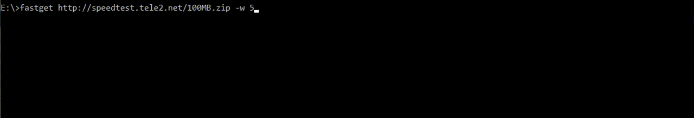

[](https://goreportcard.com/report/github.com/pgollangi/fastget)


[](https://pkg.go.dev/github.com/pgollangi/fastget)
[](https://codeclimate.com/github/pgollangi/fastget/maintainability)


# FastGet

A CLI tool as well as go library to ultrafast download files over HTTP(s).

> DISCLAIMER: FastGet performance heavily reliant on the network and CPU performance of the client machine. More importantly HTTP(s) endpoint must allow partial requests presenting `Accept-Ranges` and accepting `Range` headers.


## Demo 


## Usage
`fastget` available as Commnad-Line tool and Go library.
### Commnad-Line

```sh
fastget [options] <URL_TO_DOWNLOAD>
```
#### Examples
```sh
$ fastget http://speedtest.tele2.net/10MB.zip
Download started..
3.50 MB / 3.50 MB 100 % [===========================================================================| 0s ] 267.59 KB/s
3.50 MB / 3.50 MB 100 % [===========================================================================| 0s ] 165.65 KB/s
3.50 MB / 3.50 MB 100 % [===========================================================================| 0s ] 116.10 KB/s
Download finished in 3s. File: E:\10MB.zip
```

Read the  [documentation](https://dev.pgollangi.com/fastget)  for more information on the CLI usage.

### Go Library

Here is a simple example that finds fastest hosts:

```go
fg, err := fastget.NewFastGetter("http://speedtest.tele2.net/10MB.zip")
if err != nil {
    panic(err)
}

result, err := fg.Get()
if err != nil {
    panic(err)
}
file := result.OutputFile
elapsedTime := result.ElapsedTime

```
Read the  [API documentation](https://pkg.go.dev/github.com/pgollangi/fastget) for more information on the library usage.

## Installation 

### Scoop
```sh
scoop bucket add pgollangi-bucket https://github.com/pgollangi/scoop-bucket.git
scoop install fastget
```
Updating:
```
scoop update fastget
```
### Homebrew
```sh
brew install pgollangi/tap/fastget
```
Updating:
```
brew upgrade fastget
```
### Go
```sh
$ go get github.com/pgollangi/fastget/cmd/fastget
$ fastget
```

### Manual
1. Download and install binary from the [latest release](https://github.com/pgollangi/fastget/releases/latest).
2. Recommended: add `fastget` executable to your $PATH.

## Building from source

`fastget` CLI is written in the [Go programming language](https://golang.org/), so to build the CLI yourself, you first need to have Go installed and configured on your machine.

### Install Go

To download and install  `Go`, please refer to the  [Go documentation](https://golang.org/doc/install). Please download  `Go 1.14.x`  or above.

### Clone this repository
```sh
$ git clone https://gitlab.com/pgollangi/fastget.git
$ cd fastget
```
### Build

```sh
$ go build cmd/fastget/main.go
$ fastget
```

## Contributing
Thanks for considering contributing to this project!

Please read the [Contributions](.github/CONTRIBUTING.md) and [Code of conduct](.github/CODE_OF_CONDUCT.md). 

Feel free to open an issue or submit a pull request!

## License
Copyright © [Prasanna Kumar](https://pgollangi.com)

`fastget` is open-sourced software licensed under the [MIT](LICENSE) license.

## Author
Built with ❤ by [Prasanna Kumar](https://pgollangi.com/tabs/about/)
